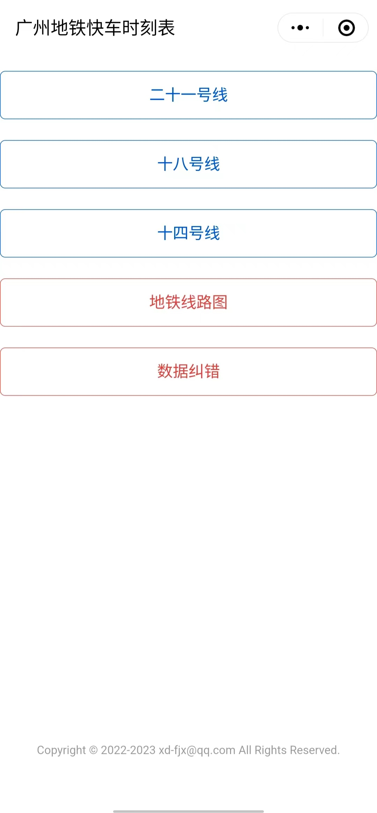
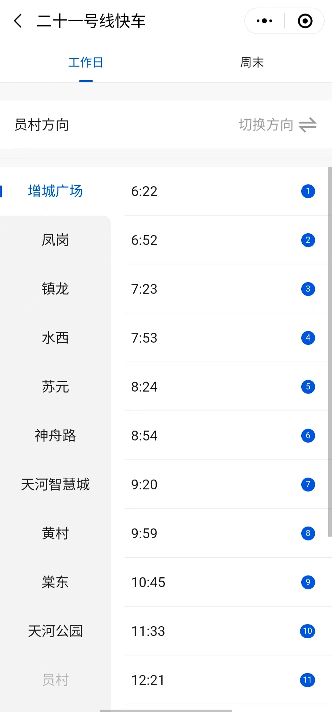
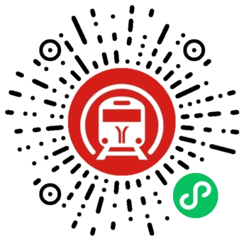

# 广州地铁快车时刻表小程序，前端 + 后端

使用微信云托管开发部署示例项目

技术栈：[tdesign](https://tdesign.tencent.com/miniprogram/overview) + golang。

可以作为小程序、go web、云托管入门学习案例。

## 预览

<p float="left">
  
  
  
</p>

## 工程结构

```
- gzeweapp: 小程序前端工程
- gzesvr：小程序服务端工程
```

服务端工程仅用于测试演示，实际开发你需要自己实现动态获取数据的逻辑，例如从数据库读取数据。


## 快速部署

（待补充）

## 参考手册


## 声明

本项目作为一个新手入门学习开源项目，也不对项目代码做任何限制，你可以任意修改用于其他任意用途。
